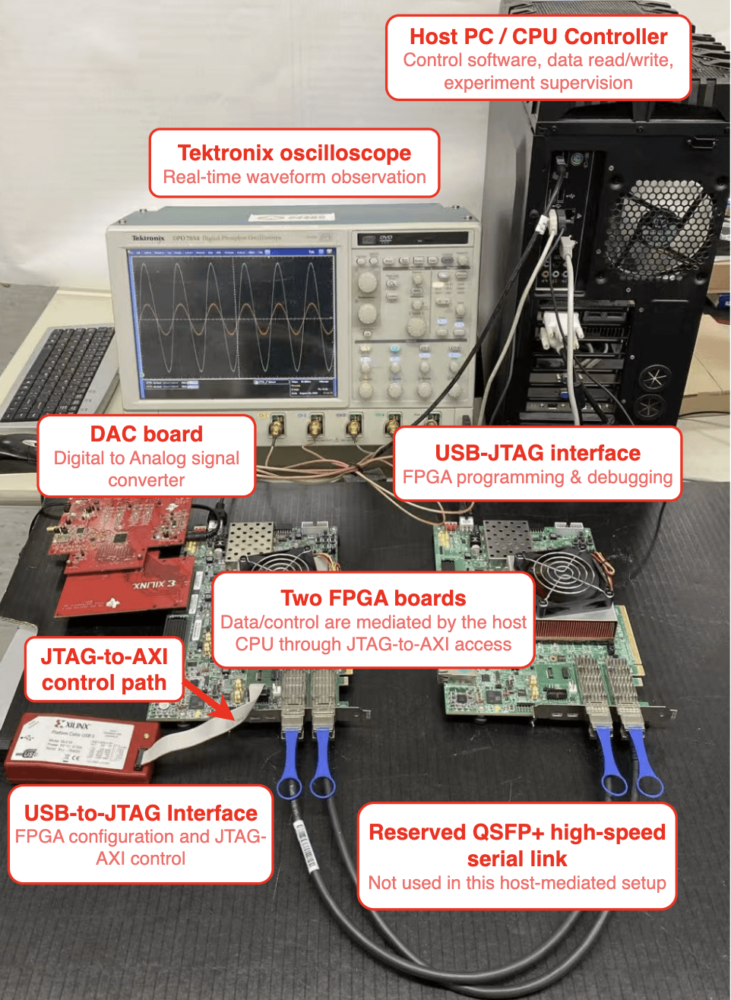
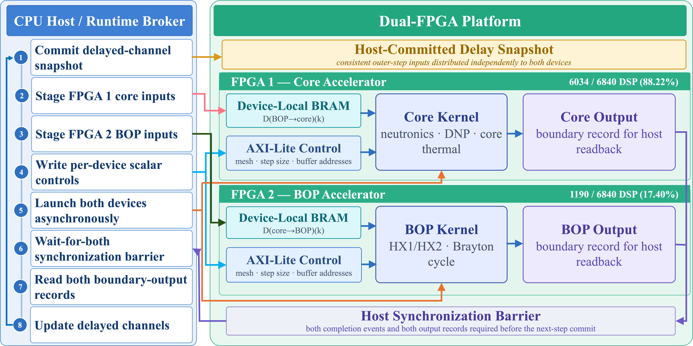
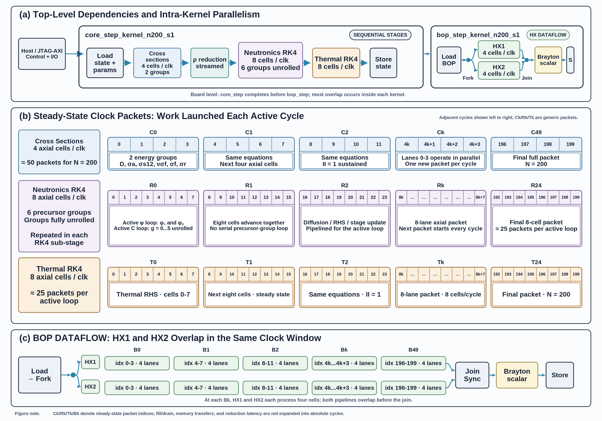

# MSRE-RT

MSRE-RT is a reduced real-time emulation workflow for a one-dimensional
molten-salt reactor model. The repository keeps the numerical reference model,
same-source C++ solver, Vitis HLS implementation, verification/evaluation
scripts, and implementation documentation in separate, runnable sections.

The codebase is organized around one conversion path:

```text
Python reference model -> plain C++ reference solver -> Vitis HLS split kernels
```

The hardware path uses a host-controlled split between the reactor core kernel
and the balance-of-plant (BOP) kernel. The split is made at modeled physical
transport-delay boundaries, so the host runtime can stage committed delayed
boundary values before launching the kernels.

## Repository Layout

- `python/`: executable Python reference model and physics modules.
- `C++/`: standalone plain C++ solver plus shared point-kinetics logic.
- `Vitis/`: HLS-oriented kernels, VCU118 host tooling, Vivado/Vitis scripts,
  and hardware analysis artifacts.
- `Verification_Evaluation/`: verification scripts, reproducibility helpers,
  checked reference data, and generated-figure tooling.
- `documentation/`: design notes, README figures, and HLS synthesis reports.

Generated outputs should go under ignored output directories such as
`Verification_Evaluation/outputs/`, `/tmp/...`, or tool-specific build
directories. The manuscript workspace `paper_writing/` is intentionally ignored
and is not part of the public repository.

## Hardware Figures

**Board-level experimental setup for the host-controlled VCU118
implementation tests.**



**Host-FPGA delayed-coupling scheduling.**



**HLS schedule diagram for the Nz = 200, s = 1 split design study.**



## Prerequisites

- Python 3 with `numpy`, `scipy`, and `matplotlib` for the reference and
  verification scripts.
- A C++17 compiler and CMake for the plain C++ and Vitis syntax/build checks.
- Xilinx/Vivado/Vitis HLS tools only for FPGA synthesis, bitstream generation,
  programming, or hardware-manager workflows.

Every runnable Python script exposes its runtime inputs through `argparse`.
Use `--help` before changing case definitions, control insertions, output
locations, timing repeats, or hardware paths.

## Quick Start: Python Reference Model

Run a short reference simulation with a configurable reactivity insertion:

```sh
python3 python/main.py \
  --steps 2 \
  --n 20 \
  --steady-state-steps 1 \
  --control-pcm -75 \
  --control-time-s 1 \
  --output-dir /tmp/msre_python_smoke \
  --no-plots \
  --json
```

Common inputs include `--steps`, `--n`, `--outer-dt`, `--control-pcm`,
`--control-time-s`, `--reactivity-schedule`, `--core-inlet-mode`, and
`--output-dir`. Use `--set KEY=VALUE` for scalar parameter overrides that are
not promoted to dedicated flags.

## Quick Start: Plain C++ Solver

Build and run the same-source C++ reference solver:

```sh
cmake -S C++ -B /tmp/msre_cpp_build
cmake --build /tmp/msre_cpp_build
/tmp/msre_cpp_build/msr_plain \
  --steps 2 \
  --n 20 \
  --steady-state-steps 1 \
  --control-pcm -75 \
  --control-time-s 1 \
  --output-dir /tmp/msre_cpp_smoke
```

The C++ executable accepts named inputs such as `--steps`, `--n`,
`--outer-dt`, `--steady-state-steps`, `--core-inlet-mode`, `--v-core`,
`--control-pcm`, `--control-time-s`, and `--output-dir`. The older positional
form is still accepted:

```sh
msr_plain steps output_dir control_pcm control_time_s
```

## Quick Start: Vitis And VCU118 Code

Run the local CMake syntax/build check for the HLS-oriented source:

```sh
cmake -S Vitis -B /tmp/msre_vitis_build
cmake --build /tmp/msre_vitis_build
```

Inspect user-facing analysis and host-tool interfaces:

```sh
python3 -m Vitis.analyze_transient_batch_bench --help
python3 -m Vitis.analyze_fpga_kernel_run --help
python3 -m Vitis.vcu118.msr_vcu118_host --help
python3 -m Vitis.vcu118.msr_transient_batch_vcu118_host --help
```

HLS and Vivado entry points live under `Vitis/hls_modules/` and
`Vitis/vcu118/`. Example synthesis scripts include:

```sh
vitis_hls -f Vitis/hls_modules/hls_core_step_n200_s1_10ns_lowlane.tcl
vitis_hls -f Vitis/hls_modules/hls_bop_step_n200_s1_10ns_lowlane.tcl
```

Bitstreams, when generated and small enough for GitHub, should be placed under
`Vitis/bitstreams/`.

## Quick Start: Verification And Evaluation

Run the split-scheduler consistency smoke test:

```sh
python3 -m Verification_Evaluation.async_split_prototype \
  --steps 1 \
  --n 20 \
  --steady-state-steps 1 \
  --control-pcm -75 \
  --control-time-s 0 \
  --json
```

Run a reduced reactivity sweep:

```sh
python3 -m Verification_Evaluation.reactivity_sweep \
  --quick \
  --case-pcm 0,-75 \
  --insertion-time-s 1 \
  --end-time-s 3 \
  --n-points 20 \
  --steady-state-steps 1 \
  --steady-state-outer-iterations 1 \
  --output-dir /tmp/msre_reactivity_smoke
```

Run a small external delayed-neutron circulation validation:

```sh
python3 -m Verification_Evaluation.external_validation \
  --nodes 20 \
  --reported-n 20 \
  --steady-steps 1 \
  --skip-present-verification \
  --output-dir /tmp/msre_external_smoke
```

Inspect generated NPZ output:

```sh
python3 -m Verification_Evaluation.read_npz /tmp/msre_python_smoke/specific_data_0.npz --list-only
python3 -m Verification_Evaluation.get_npz_data \
  --simulation-dir /tmp/msre_python_smoke \
  --output /tmp/msre_neutron_flux.csv \
  --start-index 0 \
  --end-index 0 \
  --step 1
```

## Quick Start: Documentation

HLS synthesis reports copied from the Windows/Vitis runs are tracked under:

```text
documentation/synthesis_reports/windows_hls_reports/
```

README figures are tracked under:

```text
documentation/readme_assets/
```

Design notes live under `documentation/docs/`. These files are documentation
artifacts only; running simulations and synthesis flows should write new outputs
to ignored output directories unless the result is intentionally curated.

## One-Command Sanity Checks

From the repository root:

```sh
python3 -m py_compile python/*.py Verification_Evaluation/*.py Vitis/*.py Vitis/vcu118/*.py
cmake -S C++ -B /tmp/msre_cpp_build && cmake --build /tmp/msre_cpp_build
cmake -S Vitis -B /tmp/msre_vitis_build && cmake --build /tmp/msre_vitis_build
python3 -m Verification_Evaluation.async_split_prototype --steps 1 --n 20 --steady-state-steps 1 --json
python3 -m Verification_Evaluation.reactivity_sweep --quick --case-pcm 0,-75 --insertion-time-s 1 --end-time-s 3 --n-points 20 --steady-state-steps 1 --steady-state-outer-iterations 1 --output-dir /tmp/msre_reactivity_smoke
```

## Current Hardware Design Notes

The split design uses two shape-specialized top-level kernels for the
`Nz = 200, s = 1` hardware study:

- `core_step_kernel_n200_s1`
- `bop_step_kernel_n200_s1`

The measured JTAG-AXI board path launches the kernels sequentially under host
control and includes launch, wait, boundary staging, and scalar readback
overhead. The same delayed-boundary protocol also supports the host-mediated
dual-FPGA implementation: the core and BOP kernels can be placed on separate
VCU118 devices, and the host runtime manages physical-delay boundary channels
without direct board-to-board communication.

The per-kernel HLS reports are stored in `documentation/synthesis_reports/`.
They include `csynth` reports, schedule XML, design XML, schedule diagrams, and
the extracted N80 XML bundle.
