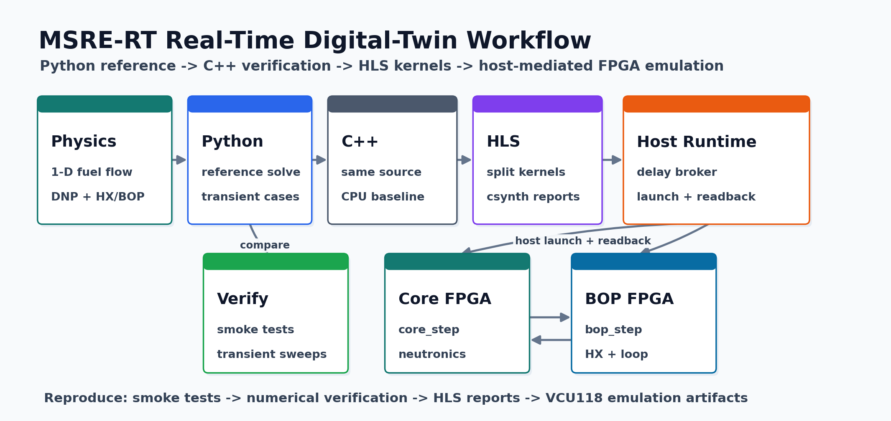

# MSRE-RT

A reproducible real-time digital-twin workflow for a 1-D flowing-fuel
Molten-Salt Reactor Experiment model, spanning Python reference simulation,
same-source C++ verification, and a host-mediated Vivado/Vitis HLS
split-kernel workflow for VCU118 and dual-FPGA-ready deployment.

[](requirements.txt)
[](C++/CMakeLists.txt)
[](Vitis/README.md)
[](Vitis/vcu118/README.md)
[](https://github.com/yuyao-wang/MSRE-RT/actions/workflows/smoke.yml)
[](LICENSE)



## Highlights

- End-to-end path: Python reference model -> same-source C++ -> HLS kernels.
- Host-mediated split between reactor-core and balance-of-plant kernels at
  modeled transport-delay boundaries.
- Verification scripts for numerical consistency, delayed-neutron circulation,
  and transient evaluation.
- Hardware-oriented implementation for VCU118 and Vivado/Vitis HLS experiments,
  including board setup photos, host tools, synthesis reports, and checked
  analysis artifacts.

## Key Results

| Item | Result |
| --- | --- |
| Hardware platform | Host-mediated VCU118 / dual-FPGA-ready split-kernel workflow; current board validation through VCU118 JTAG-AXI runtime |
| Core kernel | `core_step_kernel_n200_s1`, 13,723..13,783 cycles in the aggressive HLS comparison artifact |
| BOP kernel | `bop_step_kernel_n200_s1`, 2,334 cycles in the aggressive HLS comparison artifact |
| Step latency | 321.74 us HLS-only sequential core+BOP estimate; 3,043 us measured current board wait path |
| Faster-than-real-time factor | 3.1e3x HLS-only and 329x current board wait path for a 1 s model step |
| Python reference comparison | HLS-only path is 57.0x faster than the Python one-step reference; current board wait path is 6.03x faster |
| Board readback consistency | VCU118 snapshot readback matches the same-source CPU kernel for the reported core/BOP boundary metrics |

The front-page latency numbers come from
[`Vitis/analysis_artifacts/fpga_compare_20260617/report.md`](Vitis/analysis_artifacts/fpga_compare_20260617/report.md).
Tracked synthesis reports under `documentation/synthesis_reports/` preserve the
corresponding Vivado HLS report artifacts used for hardware discussion.

## What You Can Reproduce

The repository supports three reproducibility levels:

1. **Software smoke test:** Python import/runtime checks plus C++ and Vitis
   syntax/build checks.
2. **Numerical verification:** transient comparison, split-scheduler
   consistency, and delayed-neutron circulation checks.
3. **Hardware-oriented flow:** Vivado/Vitis HLS scripts, VCU118 host-side
   tooling, and checked board-run analysis artifacts.

Start with the one-command smoke script:

```sh
bash scripts/run_smoke_tests.sh
```

## Repository Layout

| Path | Purpose |
| --- | --- |
| `python/` | Executable Python reference model and physics modules |
| `C++/` | Standalone plain C++ solver plus shared point-kinetics logic |
| `Vitis/` | HLS-oriented kernels, VCU118 host tooling, Vivado/Vitis scripts, and hardware analysis artifacts |
| `Verification_Evaluation/` | Verification scripts, reproducibility helpers, checked reference data, and generated-figure tooling |
| `documentation/` | Documentation entry point, README figures, design notes, and HLS synthesis reports |

Generated outputs should go under ignored output directories such as
`Verification_Evaluation/outputs/`, `/tmp/...`, or tool-specific build
directories. The manuscript workspace `paper_writing/` is intentionally ignored
and is not part of the public repository.

## Quick Start

Install Python dependencies:

```sh
python3 -m pip install -r requirements.txt
```

Run a short Python reference simulation:

```sh
python3 python/main.py \
  --steps 2 \
  --n 20 \
  --steady-state-steps 1 \
  --control-pcm -75 \
  --control-time-s 1 \
  --output-dir /tmp/msre_python_smoke \
  --no-plots \
  --json
```

Build and run the same-source C++ reference solver:

```sh
cmake -S C++ -B /tmp/msre_cpp_build
cmake --build /tmp/msre_cpp_build
/tmp/msre_cpp_build/msr_plain \
  --steps 2 \
  --n 20 \
  --steady-state-steps 1 \
  --control-pcm -75 \
  --control-time-s 1 \
  --output-dir /tmp/msre_cpp_smoke
```

Run the local CMake syntax/build check for the HLS-oriented source:

```sh
cmake -S Vitis -B /tmp/msre_vitis_build
cmake --build /tmp/msre_vitis_build
```

Run the split-scheduler consistency smoke test:

```sh
python3 -m Verification_Evaluation.async_split_prototype \
  --steps 1 \
  --n 20 \
  --steady-state-steps 1 \
  --control-pcm -75 \
  --control-time-s 0 \
  --json
```

## Verification Snapshot

The checked verification artifacts include delayed-neutron circulation
comparisons, transient response metrics, CPU/HLS timing summaries, and board
readback comparisons.

Useful entry points:

```sh
python3 -m Verification_Evaluation.reactivity_sweep --help
python3 -m Verification_Evaluation.external_validation --help
python3 -m Verification_Evaluation.generate_evaluation_figures --help
python3 -m Vitis.analyze_transient_batch_bench --help
python3 -m Vitis.analyze_fpga_kernel_run --help
```

## Hardware Figures

The first figure in this README is the clean system overview. The hardware
evidence is kept below the results-oriented sections.

**Host-FPGA delayed-coupling scheduling.**


**Board-level experimental setup for the host-controlled VCU118 implementation
tests.**

<p align="center">
  
</p>

**HLS schedule diagram for the Nz = 200, s = 1 split design study.**


## Documentation

Detailed documentation is organized under [`documentation/`](documentation/):

- [`model.md`](documentation/docs/model.md): model scope and physical
  decomposition.
- [`numerical_reference.md`](documentation/docs/numerical_reference.md):
  Python reference simulation.
- [`cpp_solver.md`](documentation/docs/cpp_solver.md): same-source C++ solver.
- [`fpga_hls_design.md`](documentation/docs/fpga_hls_design.md): HLS split
  kernels and synthesis reports.
- [`host_runtime.md`](documentation/docs/host_runtime.md): host-mediated
  runtime and dual-FPGA-ready protocol.
- [`verification.md`](documentation/docs/verification.md): numerical
  verification entry points.
- [`hardware_results.md`](documentation/docs/hardware_results.md): hardware and
  timing results.
- [`reproducibility.md`](documentation/docs/reproducibility.md): artifact
  reproduction levels and commands.

## Citation And Release

Use [`CITATION.cff`](CITATION.cff) when citing this artifact. Release notes are
tracked in [`CHANGELOG.md`](CHANGELOG.md), and the release checklist is in
[`RELEASE.md`](RELEASE.md). A DOI/Zenodo badge should be added only after an
archived release exists.

Notebook usage is intentionally limited. Existing notebooks are treated as
exploratory/reporting artifacts and excluded from GitHub language statistics via
`.gitattributes`; repeatable outputs should be generated by scripts.

## Safety And Scope

This repository is a research prototype for numerical and hardware-emulation
studies. It is not a safety-certified reactor analysis tool.
