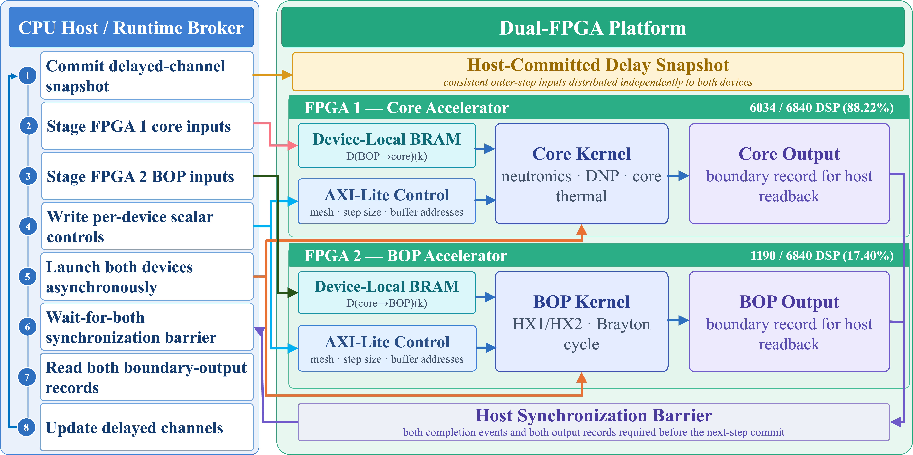
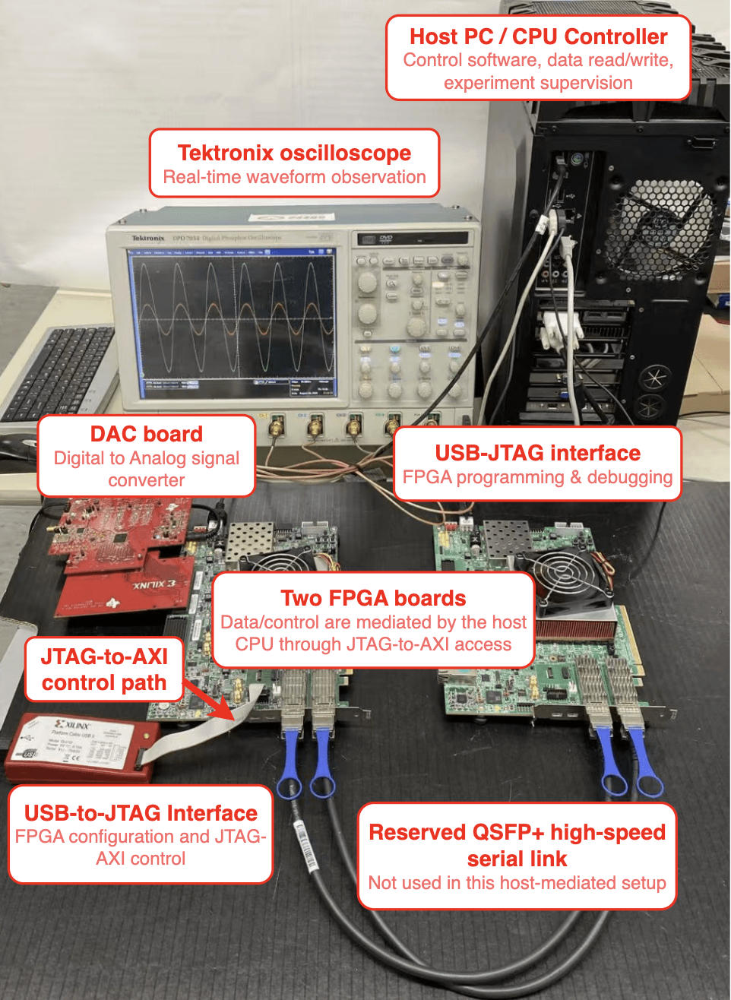
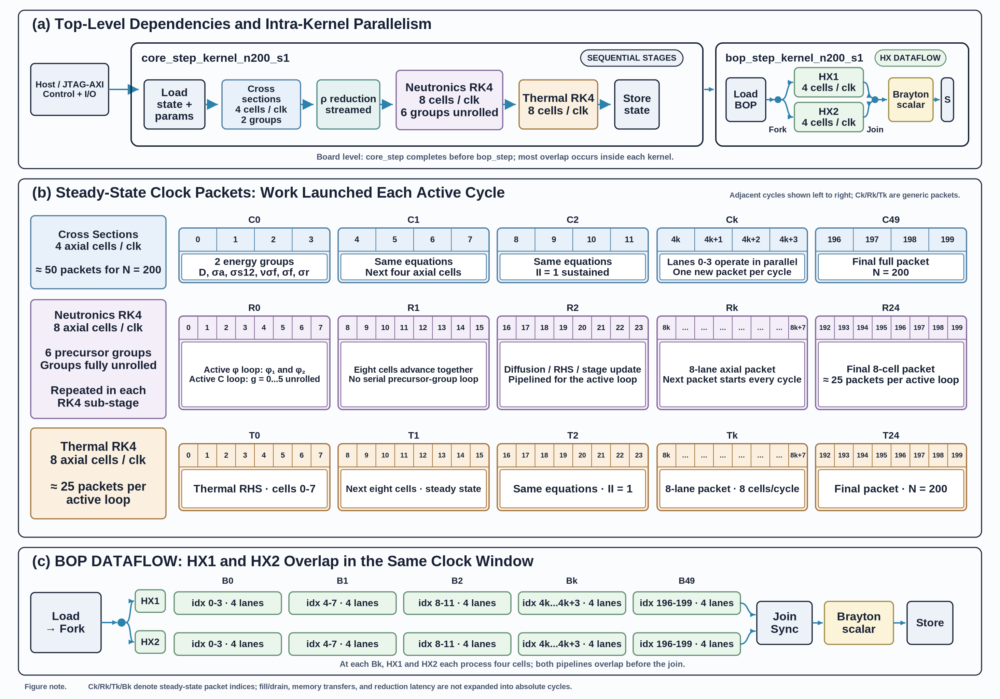

# MSRE-RT

A deterministic real-time digital-twin framework for the Molten-Salt Reactor
Experiment, integrating flowing-fuel reactor dynamics, delayed
core–balance-of-plant coupling, and FPGA-oriented host-mediated emulation for
faster-than-real-time transient studies.

[](LICENSE)
[](docs/docs/reproducibility.md)
[](fpga_emulation/vcu118/README.md)
[](fpga_emulation/analysis_artifacts/fpga_compare_20260617/report.md)
[](README.md)

## System Contribution

- A deterministic transient model for flowing-fuel MSRE dynamics with explicit
  delayed-neutron and heat-transport coupling.
- A host-mediated emulation framework that separates reactor-core and
  balance-of-plant execution while preserving modeled transport-delay
  semantics.
- Cross-level checks for numerical behavior, delayed-boundary consistency,
  transient response, and board readback.
- Hardware-oriented split-kernel execution artifacts for VCU118 experiments and
  dual-FPGA-ready deployment studies.

## Key Results

| Item | Result |
| --- | --- |
| Hardware platform | Host-mediated VCU118 / dual-FPGA-ready split-kernel emulation path; current board validation through VCU118 JTAG-AXI runtime |
| Core split kernel | `core_step_kernel_n200_s1`, 13,723..13,783 cycles in the aggressive synthesis comparison artifact |
| BOP split kernel | `bop_step_kernel_n200_s1`, 2,334 cycles in the aggressive synthesis comparison artifact |
| Step latency | 321.74 us synthesis-estimated sequential core+BOP path; 3,043 us measured current board wait path |
| Faster-than-real-time factor | 3.1e3x synthesis-estimated path and 329x current board wait path for a 1 s model step |
| Numerical-reference comparison | Synthesis-estimated path is 57.0x faster than the one-step numerical reference; current board wait path is 6.03x faster |
| Board readback consistency | VCU118 snapshot readback matches the verification-oriented software kernel for the reported core/BOP boundary metrics |

The front-page latency numbers come from
[`fpga_emulation/analysis_artifacts/fpga_compare_20260617/report.md`](fpga_emulation/analysis_artifacts/fpga_compare_20260617/report.md).
Tracked synthesis reports under `docs/synthesis_reports/` preserve the
corresponding report artifacts used for hardware discussion.

## What You Can Reproduce

The repository supports three reproducibility levels:

1. **Software smoke test:** runtime checks plus verification-oriented and
   FPGA-oriented source build checks.
2. **Numerical verification:** transient comparison, split-scheduler
   consistency, and delayed-neutron circulation checks.
3. **Hardware-oriented flow:** synthesis scripts, VCU118 host-side tooling,
   and checked board-run analysis artifacts.

Start with the one-command smoke script:

```sh
bash scripts/run_smoke_tests.sh
```

## Artifact Organization

The artifact is organized by engineering role rather than programming
language. The numerical reference establishes expected transient behavior; the
hardware-mapping implementation translates and checks the deployable
algorithms; and the FPGA-emulation layer evaluates split-kernel execution. The
verification suite checks consistency across all three levels.

| Path | Engineering role | Primary implementation |
| --- | --- | --- |
| `reference_model/` | Numerical reference for transient behavior and model exploration | Python |
| `hardware_mapping/` | Deployment-oriented algorithm mapping and pre-FPGA consistency checks | C++17 |
| `fpga_emulation/` | Split kernels, host orchestration, synthesis, and VCU118 tooling | Vitis HLS C++, Python, Tcl |
| `verification/` | Cross-level numerical checks, transient evaluation, and reproducibility utilities | Python |
| `docs/` | Model, implementation, hardware, and reproducibility documentation | Markdown, report artifacts |

Generated outputs should go under ignored output directories such as
`verification/outputs/`, `/tmp/...`, or tool-specific build
directories. The manuscript workspace `paper_writing/` is intentionally ignored
and is not part of the public repository.

## Quick Start

Install Python dependencies:

```sh
python3 -m pip install -r requirements.txt
```

Run a short numerical-reference simulation (Python):

```sh
python3 reference_model/main.py \
  --steps 2 \
  --n 20 \
  --steady-state-steps 1 \
  --control-pcm -75 \
  --control-time-s 1 \
  --output-dir /tmp/msre_python_smoke \
  --no-plots \
  --json
```

Build and run the hardware-mapping implementation (C++17):

```sh
cmake -S hardware_mapping -B /tmp/msre_cpp_build
cmake --build /tmp/msre_cpp_build
/tmp/msre_cpp_build/msr_plain \
  --steps 2 \
  --n 20 \
  --steady-state-steps 1 \
  --control-pcm -75 \
  --control-time-s 1 \
  --output-dir /tmp/msre_cpp_smoke
```

Run the local syntax/build check for the FPGA-emulation source (Vitis HLS C++):

```sh
cmake -S fpga_emulation -B /tmp/msre_vitis_build
cmake --build /tmp/msre_vitis_build
```

Run the split-scheduler consistency smoke test:

```sh
python3 -m verification.async_split_prototype \
  --steps 1 \
  --n 20 \
  --steady-state-steps 1 \
  --control-pcm -75 \
  --control-time-s 0 \
  --json
```

## Verification Snapshot

The checked verification artifacts include delayed-neutron circulation
comparisons, transient response metrics, software/hardware timing summaries, and board
readback comparisons.

Useful entry points:

```sh
python3 -m verification.reactivity_sweep --help
python3 -m verification.external_validation --help
python3 -m verification.generate_evaluation_figures --help
python3 -m fpga_emulation.analyze_transient_batch_bench --help
python3 -m fpga_emulation.analyze_fpga_kernel_run --help
```

## Hardware Figures

The first figure in this README is the clean system overview. The hardware
evidence is kept below the results-oriented sections.

**Host-FPGA delayed-coupling scheduling.**



**Board-level experimental setup for the host-controlled VCU118 implementation
tests.**

<p align="center">
  
</p>

**HLS schedule diagram for the Nz = 200, s = 1 split design study.**



## Documentation

Detailed documentation is organized under [`docs/`](docs/):

- [`model.md`](docs/docs/model.md): model scope and physical
  decomposition.
- [`numerical_reference.md`](docs/docs/numerical_reference.md):
  Python reference simulation.
- [`hardware_mapping.md`](docs/docs/hardware_mapping.md): deployment-oriented
  C++ implementation and verification role.
- [`hardware_mapping_to_fpga.md`](docs/docs/hardware_mapping_to_fpga.md):
  mapping from the software implementation to FPGA-oriented kernels.
- [`fpga_hls_design.md`](docs/docs/fpga_hls_design.md): HLS split
  kernels and synthesis reports.
- [`host_runtime.md`](docs/docs/host_runtime.md): host-mediated
  runtime and dual-FPGA-ready protocol.
- [`verification.md`](docs/docs/verification.md): numerical
  verification entry points.
- [`hardware_results.md`](docs/docs/hardware_results.md): hardware and
  timing results.
- [`reproducibility.md`](docs/docs/reproducibility.md): artifact
  reproduction levels and commands.

## Citation And Release

The article associated with MSRE-RT has been accepted for publication in
*Annals of Nuclear Energy*. The publisher proof identifies this repository as
the article's data-availability link. If you use MSRE-RT, please cite:

```bibtex
@article{wang2026digitaltwin,
  title   = {A Digital-Twin of the {MSRE}: Finite-Difference Modeling and Host-Mediated Dual-{FPGA} Real-Time Emulation},
  author  = {Wang, Yuyao and Wang, Yulin and Chen, Weiran and Dinavahi, Venkata},
  journal = {Annals of Nuclear Energy},
  year    = {2026},
  doi     = {10.1016/j.anucene.2026.112667},
  note    = {Accepted for publication}
}
```

The same preferred citation is recorded in [`CITATION.cff`](CITATION.cff).
Release notes are tracked in [`CHANGELOG.md`](CHANGELOG.md), and the release
checklist is in [`RELEASE.md`](RELEASE.md). A software DOI/Zenodo badge should
be added only after an archived release exists.

Notebook usage is intentionally limited. Existing notebooks are treated as
exploratory/reporting artifacts and excluded from GitHub language statistics via
`.gitattributes`; repeatable outputs should be generated by scripts.

## Safety And Scope

This repository is a research prototype for numerical and hardware-emulation
studies. It is not a safety-certified reactor analysis tool.
