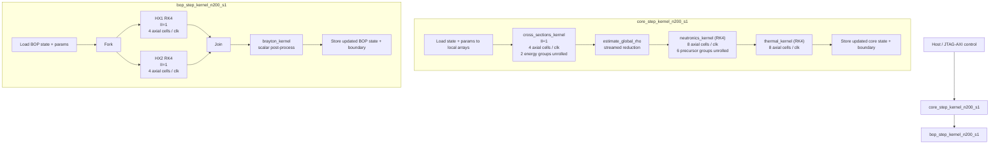
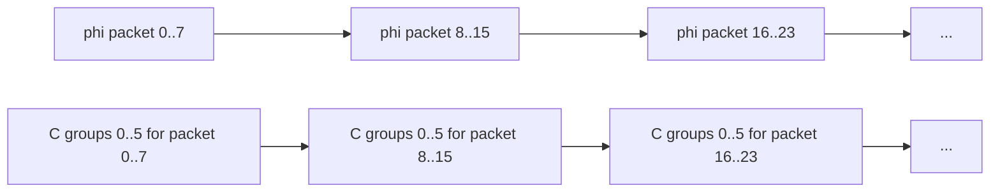
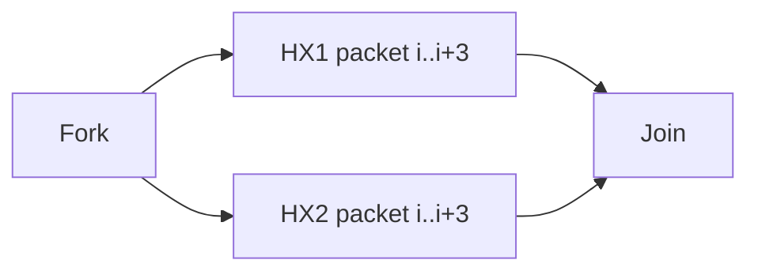
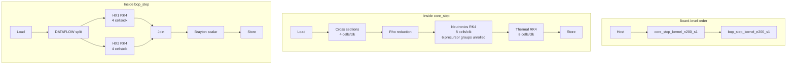

# Aggressive FPGA Parallel Design (README-Friendly)

This note summarizes the current aggressive `N=200, hardware_substeps=1` design.
It is based on the current HLS sources and the exported schedule artifacts for the `2026-06-17` aggressive build.

## 1. Current Parallelism Knobs

| Block | Parallelism in current aggressive build | Source |
| --- | --- | --- |
| Cross sections | `kCrossSectionLaneFactor = 4` | `MSR_CROSS_SECTION_LANE_FACTOR` |
| Neutronics | `kNeutronicsLaneFactor = 8` | `MSR_NEUTRONICS_LANE_FACTOR` |
| Thermal | `kThermalLaneFactor = 8` | `MSR_THERMAL_LANE_FACTOR` |
| Heat exchanger | `kHeatExchangerLaneFactor = 4` | `MSR_HEAT_EXCHANGER_LANE_FACTOR` |
| Precursor groups | `6` groups fully unrolled in the aggressive loops | `kPrecursorGroups = 6` |
| BOP overlap | `HX1 || HX2` under `#pragma HLS DATAFLOW` | `run_parallel_bop_hx_pair(...)` |

## 2. Top-Level Execution Layout

Important: the board-level flow is still `core_step` then `bop_step`.
So the main overlap is *inside* each kernel, not between the two kernels.



## 3. What One Clock Means in Steady State

The tables below are a *steady-state packet view* of the pipelined loops.
They are meant to show what a typical clock is doing after the pipeline is filled.
They do **not** claim exact absolute FSM cycle numbers from cycle `0` to cycle `13783`.

### 3.1 Cross Sections Packet View

Loop shape:

- `PIPELINE II=1`
- `UNROLL factor=4`
- `2` energy groups computed together inside each lane packet

So one steady-state clock advances one axial packet of `4` cells:

| Clock | Lane 0 | Lane 1 | Lane 2 | Lane 3 | Work done in the same clock |
| --- | --- | --- | --- | --- | --- |
| `C0` | `idx 0` | `idx 1` | `idx 2` | `idx 3` | `D`, `sigma_a`, `sigma_s12`, `nu_sigma_f`, `sigma_f`, `sigma_r` |
| `C1` | `idx 4` | `idx 5` | `idx 6` | `idx 7` | same equations for the next 4 cells |
| `C2` | `idx 8` | `idx 9` | `idx 10` | `idx 11` | same |
| `...` | `...` | `...` | `...` | `...` | `N=200` gives about `50` axial packets |

### 3.2 Neutronics Packet View

The aggressive part is not only `lane=8`, but also the precursor-group loops were reshaped so that:

- outer loop: axial `idx`
- inner loop: precursor `group`
- `group` loop is fully unrolled

That means one steady-state clock now works on:

- `8` axial cells for `phi1 / phi2`
- and, when the `dC` or `C_stage` loops are active, all `6` precursor groups for those same `8` cells

Representative packet view inside one RK4 sub-stage:

| Clock window | Axial packet per clock | Parallel work in that clock |
| --- | --- | --- |
| `RHS-A` | `idx 8k .. 8k+7` | `diffusion_term(phi1)` on 8 cells |
| `RHS-B` | `idx 8k .. 8k+7` | `diffusion_term(phi2)` on 8 cells |
| `RHS-C` | `idx 8k .. 8k+7` | `F[idx]`, delayed source, `dphi1[idx]`, `dphi2[idx]` |
| `RHS-D` | `idx 8k .. 8k+7` | `dC[group][idx]` for all `group=0..5` in parallel |
| `STAGE-PHI` | `idx 8k .. 8k+7` | `phi1_stage`, `phi2_stage` |
| `STAGE-C` | `idx 8k .. 8k+7` | `C_stage[group][idx]` for all `6` groups |
| `COMBINE-PHI` | `idx 8k .. 8k+7` | RK4 combine for `phi1`, `phi2` |
| `COMBINE-C` | `idx 8k .. 8k+7` | RK4 combine for all `6` precursor groups |

One normalized steady-state packet stripe looks like this:

```text
clock t     : phi lane[0..7] + F/delayed_source for idx 8t..8t+7
clock t+1   : phi lane[0..7] + F/delayed_source for idx 8t+8..8t+15
...
clock u     : C[group=0..5][idx 8u..8u+7] update in parallel
clock u+1   : C[group=0..5][idx 8u+8..8u+15] update in parallel
...
```

Visual summary:



### 3.3 Thermal Packet View

Loop shape:

- `PIPELINE II=1`
- `UNROLL factor=8`

So one steady-state thermal clock advances `8` axial cells:

| Clock | Cells processed in that clock | Work done |
| --- | --- | --- |
| `T0` | `idx 0..7` | `dfuel`, `dgraphite` |
| `T1` | `idx 8..15` | `dfuel`, `dgraphite` |
| `T2` | `idx 16..23` | `dfuel`, `dgraphite` |
| `...` | `...` | `N=200` gives about `25` axial packets per loop pass |

Within one RK4 update, the packet order is:

```text
k1_rhs -> stage12 -> k2_rhs -> stage23 -> k3_rhs -> stage34 -> k4_rhs -> combine
```

and every one of those packet loops runs at `8 cells / clk` once the pipe is full.

### 3.4 BOP Packet View: HX1 and HX2 Truly Run Together

This is the only place where the aggressive design adds *task-level* overlap, not just wider spatial lanes.

- `HX1` uses `4` cells / clock
- `HX2` uses `4` cells / clock
- both are inside the same `DATAFLOW` region

Representative steady-state window:

| Clock | HX1 work | HX2 work | Parallelism visible to the hardware |
| --- | --- | --- | --- |
| `B0` | `idx 0..3` | `idx 0..3` | both exchangers active |
| `B1` | `idx 4..7` | `idx 4..7` | both exchangers active |
| `B2` | `idx 8..11` | `idx 8..11` | both exchangers active |
| `...` | `...` | `...` | until both streams drain |



## 4. A Single README Figure You Can Paste

If you want one compact figure for a README, this one is the safest summary:



## 5. How to Read the Diagram Correctly

1. `core_step` and `bop_step` are still launched one after the other by the host.
2. Inside `core_step`, the current aggressive design is mostly *spatial parallelism*:
   - wider axial packets in `cross_sections`, `neutronics`, `thermal`
   - full unroll across the `6` precursor groups in the reshaped loops
3. Inside `bop_step`, the current aggressive design adds *task parallelism*:
   - `HX1` and `HX2` now run concurrently in the same `DATAFLOW` region
4. The tables above show the meaning of one steady-state clock after pipeline fill, not the exact global cycle index in the full HLS latency report.

## 6. Grounding Files

This diagram was grounded against:

- `vitis/msr_vitis_kernel.cpp`
- `vitis/msr_vitis_module_tops.cpp`
- `Vitis/analysis_artifacts/fpga_compare_20260617/cross_sections_kernel_cycle_trace.csv`
- `Vitis/analysis_artifacts/fpga_compare_20260617/neutronics_kernel_cycle_trace.csv`
- `Vitis/analysis_artifacts/fpga_compare_20260617/thermal_kernel_cycle_trace.csv`
- `Vitis/analysis_artifacts/fpga_compare_20260617/hx_kernel_cycle_trace.csv`
